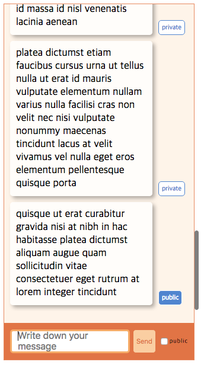

##  React Chat interface
This is just a interface for listing messages using react.

[Demo](https://chattest-5eca5.firebaseapp.com/)

- You write text and click send button, then it shows up on the screen.
- If you check 'public' check box, it shows 'public' label, else it shows 'private'.
- For the initial data, basically, it calls a get request api, but if there's no server, it uses [static json data](https://github.com/sunyrora/chat-test/tree/master/src/data/MOCK_DATA.js) .
- Same for post message. It calls a post request api first, when no server, get data from static file.
- I use [json-server](https://github.com/typicode/json-server) to see the request works fine.
- I use [jest](https://facebook.github.io/jest/) and [enzyme](http://airbnb.io/enzyme/) for testing.
